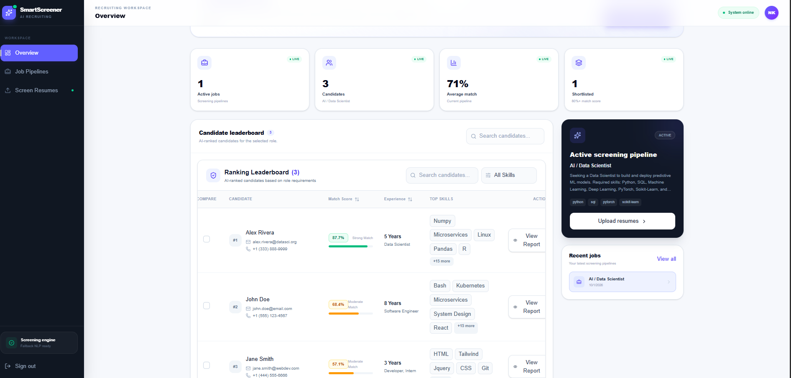

# SmartScreener

AI-powered resume screening. Create a job pipeline, upload candidate resumes, and SmartScreener extracts, scores and ranks candidates against the role.



**Live demo**
- Frontend: https://smart-screener-silk.vercel.app
- Backend API: https://smartscreener.onrender.com (docs at `/docs`)

> The backend runs on Render's free tier, so the first request after inactivity can take 30-60 seconds.

## Features

- Create job pipelines with auto-extracted required skills
- Upload multiple resumes (PDF, DOCX, DOC, TXT)
- Automatic extraction of name, contact info, skills, experience and education
- Scoring on technical skills, experience and education, plus an overall match score
- Candidate leaderboard with search
- Detailed candidate profile view
- Side-by-side candidate comparison
- Works with a local Ollama LLM, or falls back to a built-in NLP mode

## Tech Stack

| Layer | Technology |
|---|---|
| Frontend | Next.js, React, TypeScript, Tailwind CSS, lucide-react |
| Backend | FastAPI (Python), Uvicorn |
| Database | SQLite |
| AI / NLP | Ollama (optional), local NLP fallback |
| Hosting | Vercel (frontend), Render (backend) |

## Project Structure

```
SmartScreener/
├── backend/
│   └── app/
│       ├── main.py          # FastAPI app and routes
│       ├── database.py      # SQLite access
│       ├── models/          # Pydantic schemas
│       └── services/        # parser, extractor, scorer
├── frontend/
│   └── app/
│       ├── components/      # dashboard, leaderboard, candidate-detail, ...
│       ├── dashboard/       # dashboard page
│       └── config.ts        # API base URL
├── test_resumes/            # sample resumes for testing
└── run.sh
```

## Run Locally

### Backend

```bash
cd backend
python -m venv venv
venv\Scripts\activate          # Windows
# source venv/bin/activate     # macOS / Linux
pip install -r requirements.txt
uvicorn app.main:app --reload --port 8000
```

API docs: http://localhost:8000/docs

### Frontend

```bash
cd frontend
npm install
npm run dev
```

App: http://localhost:3000

By default the frontend calls `http://localhost:8000`. To point it elsewhere, create `frontend/.env.local`:

```
NEXT_PUBLIC_API_URL=http://localhost:8000
```

## API Endpoints

| Method | Endpoint | Description |
|---|---|---|
| GET | `/api/health` | Health check and LLM status |
| POST | `/api/jobs` | Create a job |
| GET | `/api/jobs` | List jobs |
| GET | `/api/jobs/{job_id}` | Get a job |
| DELETE | `/api/jobs/{job_id}` | Delete a job and its candidates |
| POST | `/api/jobs/{job_id}/resumes` | Upload and screen resumes |
| GET | `/api/jobs/{job_id}/candidates` | List ranked candidates |
| GET | `/api/candidates/{candidate_id}` | Candidate details |
| GET | `/api/jobs/{job_id}/compare?ids=1,2,3` | Compare candidates |

## Deployment

**Frontend (Vercel)**
- Root Directory: `frontend`
- Environment variable: `NEXT_PUBLIC_API_URL` = your backend URL (no trailing slash)

**Backend (Render)**
- Root Directory: `backend`
- Start Command: `uvicorn app.main:app --host 0.0.0.0 --port $PORT`
- Add your frontend URL to `allow_origins` in `backend/app/main.py`

## Known Limitations

- SQLite data on Render's free tier is not persistent and may reset on redeploy or restart.
- The login screen is a frontend demo only and is not verified by the backend.
- Ollama is not available on the hosted backend, so it runs in fallback NLP mode.

## Author

Built by [nik123-hue](https://github.com/nik123-hue).
